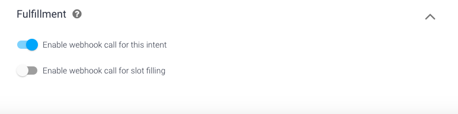
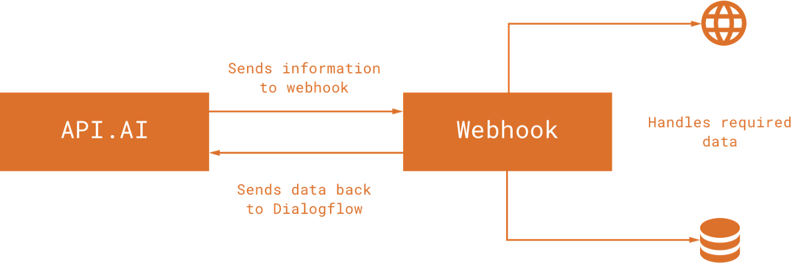

# Introduction
This repository is just a vcs of the current settings in DialogFlow. If you made changes to the lisa dialogflow client and are satisfied with the outcome, make sure to:
   * restore the fulfillment url to `https://immense-fjord-88389.herokuapp.com`
   * export the settings as zip [here](https://dialogflow.cloud.google.com/#/editAgent)
   * unpack the zip in the root directory you cloned this repository in
   * ```
      $ git commit
      $ git push
      ```
   If you messed something up, you can just clone this repository as zip from github and upload it to the dialogflow client.

## Installation
1) First, make sure to set up the backend [server](https://github.com/Official-Codaisseur-Graduate/lisa-server) if you didn't already

2) [Download](https://github.com/Official-Codaisseur-Graduate/lisa-client-dialogflow/archive/master.zip) the client as zip.
There is no need to install anything. The zip you downloaded will be used to quickly set up DialogFlow.

3) Make the server available online using either serveo or a heroku link<br>
  To use Serveo, run this in your terminal window:
    ```
    $ ssh -R 80:localhost:5000 serveo.net 
    ```
    You might need to type `yes` if a warning is thrown. The https link in green is your server URL<br>
    <br>
    Serveo is a nice tool to use while developing: https://serveo.net/
    It streams your server to the adress Serveo sets up for you. You can use this adress in DialogFlow/fulfillment.
    The link look likes this:(this one does not work)
    https://dialogflow.cloud.google.com/#/agent/`<random numbers and letters>`/fulfillment

4) Connect LISA to your local database:<br>
  <b>WARNING:</b> [this](https://dialogflow.cloud.google.com/#/agent/e4ee0583-d68d-4127-a8bd-49f3522ded28/intents) is the account used in production. Only make changes if a new backend version is deployed, otherwise you will break it<br>
  Google ID: lisa.vitalis.assistant@gmail.com<br>
  For the password, please contact Rein<br>
     <br>
     For privacy reasons, it's best to use your personal Google account and create a new agent:
     * Go to [Google Actions](https://console.actions.google.com) and create a new project
     * Scroll down and choose Actions SDK
     * Set up an invocation, preferrably 'de Kok' and save it
     * Go to the actions tab and add an action. Under custom intent, press `Build`
     * You will be redirected to the dialogflow website where a new agent can be created.
     * Make sure to set the language to Dutch (NL)
     * Once a new agent is created, import the settings like described in step 2.
     * Enable Webhook in the fulfullment tab and fill in `<your server URl>`/google-menus as URL<br>
     In your [MyAccount](https://myaccount.google.com) page, Web/App activity and Chrome history must be turned on in order to have the location feature working

5) Talk to the Google home assistant. This can also be the app on your mobile device as long as you log in with your account. Ask 'Hey google, praat met de kok' which means 'Hey Google, talk to the chef'

6) Ask what the menu is for the day you made some items for. You can also ask for just the starter, main-course, dessert for a specific day.

# Dialogflow
  
## What is Dialogflow?
Dialogflow (formerly Api.ai) is a Google-owned developer of human–computer interaction technologies based on natural language conversations. You can develop a virtual buddy for Android, iOS, and Windows Phone smartphones that performs tasks and answers users’ questions in a natural language. It also created a natural language processing engine that incorporates conversation context like dialogue history, location and user preferences.

## Agents
An Agent is a specific virtual buddy, chatbot or skill. In this case, LISA. There is an invocation to start it: “Hey Google, praat met de keuken” or “Hey Google, talk to the kitchen” will trigger “Hallo, ik ben Lisa. Wat is uw vraag?”.

[Edit invocation here](https://console.actions.google.com/u/1/project/vitalis-lisnji/invocation/)

## Entities
An Entity is a property which can be used by Dialogflow to answer the request from the user. It filters information from natural speech, and transforms it to a standardized format. LISA uses two entities:
* @sys.date-time, date, a standard Dialogflow entity 
* @gerecht, type, a custom entity

## Intents
An intent maps what a user says with what your agent does. To fetch the menu, LISA has the intent ‘menu opvragen’. 

Example questions:
* “Wat eten we vanavond?”
* “Wat staat er morgen op het menu?”
* “Wat is het toetje vandaag?”
* “Wat is dinsdag het hoofdgerecht?”

Date and course information are sent along with the request to the server. If none are specified (“Wat eten we?”), the backend route will assume full meal for today. 

## What is Fulfillment?

Dialogflow receives a request from the user (along with the entity values to be sent with the request) and now needs to request the information from the database to fulfill the user request. Now this data will be sent to our webhook so that the required information can be fetched (this will be dependent on your implementation). Once the web-hook has fetched our required information it will send it back to Dialogflow so that it can be presented to the user in the desired manner.


## How Dialogflow connects with Backend App


## What is a Webhook?
When you are working with custom backend like Node.js with Express, you need to:
* turn on the option Enable webhook, and
* call for slot filling in the Fulfillment section of the intent.




[Dialogflow docs](https://cloud.google.com/dialogflow/docs/)
