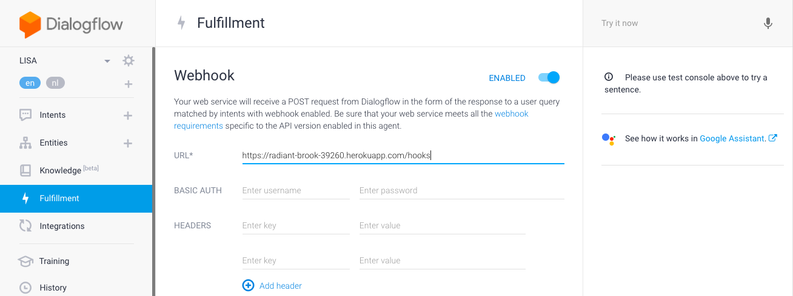
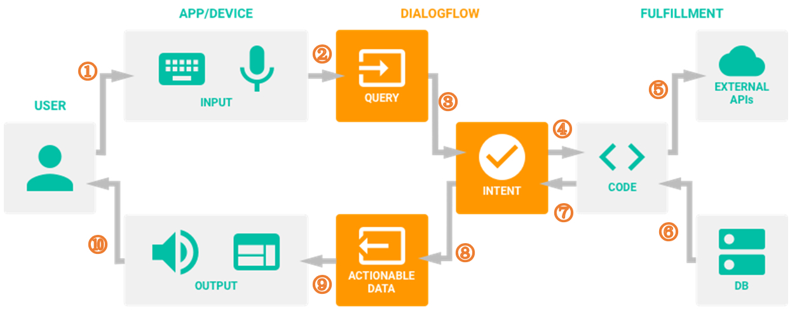

# Introduction
This repository is a version control system of the current settings in DialogFlow. It's part of the LISA Voice Assistant Project.

# Repositories in the LISA-project
- [LISA-server](https://github.com/Official-Codaisseur-Graduate/lisa-server)
- [LISA-client](https://github.com/Official-Codaisseur-Graduate/lisa-client)
- LISA Dialogflow - you are here!

## Installation
1) First, make sure to set up the backend [server](https://github.com/Official-Codaisseur-Graduate/lisa-server) if you didn't already

2) Download Zip File<br>
   <b>For development purpose</b>:<br>
   [Download](https://codeload.github.com/Official-Codaisseur-Graduate/lisa-client-dialogflow/zip/development) the Dialogflow client developer as zip.<br>
   <br>
   <b>For production purpose</b>:<br>
   [Download](https://github.com/Official-Codaisseur-Graduate/lisa-client-dialogflow/archive/master.zip) the Dialogflow client master as zip.<br>
   <br>
   <b>Both</b>:<br>
   There is no need to install anything. The zip you downloaded will be used to quickly set up DialogFlow.

3) Make your local server available online using either Serveo, Localtunnel or a Heroku link<br>
  To use **Serveo**, run this in your terminal window:
    ```
    $ ssh -R 80:localhost:5000 serveo.net 
    ```
    You might need to type `yes` if a warning is thrown. The https link in green is your server URL<br>
    <br>
    Serveo is a nice tool to use while developing: https://serveo.net/
    It streams your server to the adress Serveo sets up for you. You can use this adress in DialogFlow/fulfillment.
    The link look likes this:(this one does not work)
    https://dialogflow.cloud.google.com/#/agent/`<random numbers and letters>`/fulfillment
    <br>
    <br>
   If Serveo doesn't work, you can try **Localtunnel**. To use LocalTunner:<br>
    Install Localtunnel globally (requires NodeJS) to make it accessible anywhere:
    ```
    npm install -g localtunnel
    ```
   Start a webserver on some local port (eg http://localhost:8000) and use the command line interface to request a tunnel to your local server:
   ```
   lt --port 8000
   ```
   You will receive a url, for example https://gqgh.localtunnel.me, that you can share with anyone for as long as your local instance of lt remains active. Any requests will be routed to your local service at the specified port.

4) Connect LISA to your local database:<br>
  <b>WARNING:</b> [this](https://dialogflow.cloud.google.com/#/agent/e4ee0583-d68d-4127-a8bd-49f3522ded28/intents) is the account used in production. Only make changes if a new backend version is deployed, otherwise you will break it<br>
  **Production Account**<br>
  Google ID: lisa.vitalis.assistant@gmail.com<br>
  For the password, please contact Rein<br>
     <br>
     For privacy reasons, it's best to **use your personal Google account and create a new agent**:
     * Log out of all your Google Accounts and delete the information in your local storage before only logging in with your personal Google account to make sure you continue the next steps with the right account.
     * Go to [Dialogflow](https://dialogflow.cloud.google.com/) and log in. **NOTE** Dialogflow logs in with the Google account you are logged in with automatically. Make sure this is with your personal account.
     * Create a new agent. Besides adding a name, you should see the option to set the default language. Make sure the default language is *Dutch*. If you don't see this option. Refresh page and try again.
     * Once a new agent is created, go to the settings of the agent, click on *Export and Import* and import the zip file from step 2.
     * Enable Webhook in the fulfullment tab and fill in `<your local server URl>`/google-menus as URL<br>
     * To integrate the agent with the Google Assistant, click on the *integrations* tab and go to Google Assistant. Check if all the intents are showing up. If not, add them manually (the intents should show up if you click on *add intent*). When you are finished, click on test. If everything is set up correctly, you directed to your Google Actions test environment.
     * The agent you created is a new project in your [Google Actions](https://console.actions.google.com). Go to Google Actions and click on the name of the agent you created.
     * Go to *Decide how your action is invoked*.
     * Set up an invocation, preferrably 'de Kok' and save it.
     * Make sure to set the language to Dutch (NL).
     * In your [MyAccount](https://myaccount.google.com) page, Web/App activity and Chrome history must be turned on in order to have the location feature working.
     <br>
     <br>
     <b>Possible Errors</b><br>
     <b>The testing envrionment will not load</b> Does the testing not work, and you receive a <em>Permisson access denied</em> error? Most likely the accounts on Dialogflow and your Google Actions are not the same. You can check this by going to the settings of your agent in Dialogflow. Click on the *Share* tab, and you see the Google Account of the person who has access to the agent. If this is not your personal account remove the agent, and start again and make sure to be logged out and clean your local storage first before trying again.
     <br>
     <br>
     <b>Test envrionment works, but the menu isn't fetched?</b> If you are in your testing environment, but the fetch-menu intent doesn't work, fetch a new Serveo or Localtunnel link and connect that as your webhook.
     

5) Talk to the Google home assistant. This can also be the app on your mobile device as long as you log in with your account. Ask 'Hey Google, praat met de kok' which means 'Hey Google, talk to the chef'

6) Ask what the menu is for the day you made some items for. You can also ask for just the starter, main-course, dessert for a specific day.

## Add changes
If you made changes to the lisa dialogflow client and are satisfied with the outcome, make sure to:
   * restore the fulfillment url to `https://immense-fjord-88389.herokuapp.com` (this is the back-end that's in development. It may be outdated, so check to make sure)
   * export the settings as zip [here](https://dialogflow.cloud.google.com/#/editAgent)
   * unpack the zip in the root directory you cloned this repository in
   * ```
      $ git commit
      $ git push
      ```
   If you messed something up, you can just clone this repository as zip from github and upload it to the dialogflow client.

# Dialogflow
  
## What is Dialogflow?
Dialogflow (formerly Api.ai) is a Google-owned developer of human–computer interaction technologies based on natural language conversations. You can develop a virtual buddy for Android, iOS, and Windows Phone smartphones that performs tasks and answers users’ questions in a natural language. It also created a natural language processing engine that incorporates conversation context like dialogue history, location and user preferences.

## Agents
An Agent is a specific virtual buddy, chatbot or skill. In this case, LISA. There is an invocation to start it: “Hey Google, praat met de keuken” or “Hey Google, talk to the kitchen” will trigger “Hallo, ik ben Lisa. Wat is uw vraag?”.

[Edit invocation here](https://console.actions.google.com/u/1/project/vitalis-lisnji/invocation/)

## Entities
An Entity is a property which can be used by Dialogflow to answer the request from the user. It filters information from natural speech, and transforms it to a standardized format. LISA uses two entities:
* @sys.date-time, date, a standard Dialogflow entity 
* @gerecht, type, a custom entity

## Intents
An intent maps what a user says with what your agent does. To fetch the menu, LISA has the intent ‘menu opvragen’. 

Example questions:
* “Wat eten we vanavond?”
* “Wat staat er morgen op het menu?”
* “Wat is het toetje vandaag?”
* “Wat is dinsdag het hoofdgerecht?”

Date and course information are sent along with the request to the server. If none are specified (“Wat eten we?”), the backend route will assume full meal for today. 

## What is Fulfillment?

Dialogflow receives a request from the user (along with the entity values to be sent with the request) and now needs to request the information from the database to fulfill the user request. Now this data will be sent to our webhook so that the required information can be fetched (this will be dependent on your implementation). Once the web-hook has fetched our required information it will send it back to Dialogflow so that it can be presented to the user in the desired manner.



## How Dialogflow connects with Backend App


## What is a Webhook?
When you are working with custom backend like Node.js with Express, you need to:
* turn on the option Enable webhook, and
* call for slot filling in the Fulfillment section of the intent.


[Dialogflow docs](https://cloud.google.com/dialogflow/docs/)
